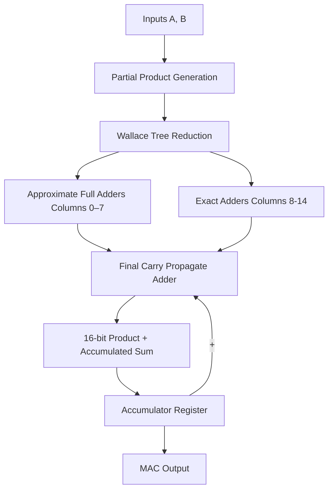

# Approximate MAC Unit using Wallace Tree Multiplier

## Overview

This project implements an **8-bit Approximate Multiply–Accumulate (MAC) Unit** in **Verilog** using a hybrid **Wallace Tree Multiplier**. Approximation is introduced in the **least significant columns of the Wallace tree reduction stage** using custom approximate full adders.

Approximate computing allows hardware designs to trade small numerical errors for improvements in **hardware complexity, power consumption, and speed**. This project explores such a trade-off in a MAC architecture.

The MAC operation implemented is:

MAC = MAC + (A × B)

Where the multiplication stage uses an **approximate Wallace tree multiplier**, while the accumulator is implemented using **exact arithmetic**.

---

## Architecture

The architecture of the MAC unit is shown below:




### Key Design Features

- 8×8 **Wallace Tree Multiplier**
- **Hybrid reduction structure**
  - Approximate Full Adders in LSB columns
  - Exact Half/Full Adders in MSB columns
- Sequential **accumulator register**
- Fully implemented in **Verilog RTL**
- Synthesized using **Xilinx Vivado**

---

## Approximate Full Adder

The approximate full adder reduces hardware complexity by simplifying the logic.

```
S = A | B | C
Cout = A & B
```

Compared to an exact full adder, this removes XOR operations and reduces gate complexity.

---

## Project Structure

```
approximate-mac-wallace
│
├── rtl
│   ├── approx_FA.v
│   ├── exact_FA.v
│   ├── exact_HA.v
│   ├── wallace_tree.v
│   ├── accumulator.v
│   ├── pp_generator.v
│   └── approx_mac.v
│
├── testbench
│   ├── tb_approx_mac.v
│   └── tb_dump_results.v
│
├── analysis
│   └── error_analysis.ipynb
│
└── README.md
```

---

## Error Analysis

The multiplier was evaluated using **exhaustive simulation of all input combinations**.

Total input combinations tested:

```
256 × 256 = 65,536
```

Simulation results were dumped from **Vivado** and analyzed using **Python**.

### Accuracy Metrics

| Metric | Value |
|------|------|
| Total Cases | 65536 |
| Error Count | 47870 |
| Error Rate (ER) | 0.7304 |
| Mean Error Distance (MED) | 81.97 |
| Normalized MED (NMED) | 0.00126 |
| Maximum Error | 600 |

Although the error rate is relatively high, the **normalized error remains very small**, indicating that most inaccuracies occur in **lower significance bits**.

---

## Error Distribution

### Error Histogram


### Error Heatmap


## Hardware Synthesis

Synthesis was performed using **Xilinx Vivado**.

| Metric | Value |
|------|------|
| DSP Usage | 0 |
| LUT Usage | 97 |
| Registers | 32 |

The multiplier is implemented entirely using **logic resources**, without using dedicated DSP blocks.

---

## Tools Used

- **Verilog** — RTL design
- **Xilinx Vivado** — synthesis and simulation
- **Python / NumPy / Matplotlib** — error analysis
- **Google Colab** — statistical evaluation

---

## Running the Project

### 1. Run Simulation in Vivado

Run the testbench:

```
tb_dump_results.v
```

This generates a file:

```
results.txt
```

containing all multiplier outputs.

---

### 2. Run Python Analysis

Upload `results.txt` and run:

```
error_analysis.ipynb
```

This computes:

- Error Rate (ER)
- Mean Error Distance (MED)
- Normalized MED (NMED)
- Maximum Error
- Error histogram
- Error heatmap

---

## Applications

Approximate arithmetic units are useful in error-tolerant applications such as:

- Machine learning accelerators
- Image processing
- Signal processing
- Edge AI hardware

---

